```mermaid
flowchart TD
    classDef cidadao fill:#dbeafe,stroke:#2563eb,color:#1e3a5f,font-weight:bold
    classDef frontstage fill:#dcfce7,stroke:#16a34a,color:#14532d
    classDef backstage fill:#fef9c3,stroke:#b45309,color:#713f12
    classDef suporte fill:#f3f4f6,stroke:#6b7280,color:#374151
    classDef normativo fill:#ede9fe,stroke:#7c3aed,color:#2e1065
    classDef failpoint fill:#fee2e2,stroke:#dc2626,color:#7f1d1d,font-weight:bold
    classDef convergencia fill:#d1fae5,stroke:#059669,color:#064e3b,font-weight:bold

    START(["Cidadão Leigo\nHipossuficiente"]):::cidadao

    START -->|"A — portal web"| CA1
    START -->|"B — WhatsApp"| CB1
    START -->|"C — deslocamento ao fórum"| CC1

    subgraph SE1["ETAPA 1 · Descoberta e Triagem"]
        CA1["Celeste\nmenu textual automático\nCanal A"]:::frontstage
        CB1["WhatsApp Business\n62 3222-5570\nCanal B"]:::frontstage
        CC1["Terminal PID no fórum\nservidor orienta presencialmente\nCanal C"]:::frontstage

        BA1[/"Sistema Celeste + STI\nlógica de roteamento"/]:::backstage
        BB1[/"Servidor WhatsApp\ntriagem manual de demandas"/]:::backstage
        BC1[/"Servidor PID\nopera terminal com o cidadão"/]:::backstage

        FP01["⚠ FP-01\nH_Interface_Celeste\nfunil de exclusão digital"]:::failpoint
        FP02["⚠ FP-02\nH_Deslocamento_Contraditório\nir ao fórum para serviço remoto"]:::failpoint

        N1[["Res. CNJ 372/2021\nacesso amplo sem\nagendamento obrigatório"]]:::normativo

        BA1 --- CA1
        BB1 --- CB1
        BC1 --- CC1

        CA1 -.->|"falha de triagem"| FP01
        CC1 -.->|"barreira prévia ao acesso"| FP02
    end

    CA1 -->|"link Zoom gerado"| EA2
    CB1 -->|"documentos enviados"| EB2
    CC1 -->|"acesso via terminal"| EC2

    subgraph SE2["ETAPA 2 · Espera e Direcionamento"]
        EA2["Waiting Room do Zoom\nsem indicador de fila\nCanal A"]:::frontstage
        EB2["Ciclo de docs no WhatsApp\nenvio e reenvio\nCanal B"]:::frontstage
        EC2["Waiting Room via terminal PID\nservidor PID ao lado\nCanal C"]:::frontstage

        BA2[/"Servidor da Vara\nmonitora Waiting Room"/]:::backstage
        BB2[/"Servidor WhatsApp\nanalisa docs e agenda Zoom"/]:::backstage
        BC2[/"Servidor PID\ncoordenação com Secretaria da Vara"/]:::backstage

        FP03["⚠ FP-03\nH_Fila\nopacidade da espera gera abandono"]:::failpoint
        FP04["⚠ FP-04\nH_Fantasma\nsala ativa sem operador humano"]:::failpoint
        FP05["⚠ FP-05\nH_Gargalo_WhatsApp\ndocs ilegíveis — ciclo de dias"]:::failpoint
        FP06["⚠ FP-06\nH_Concorrência_Recursos\nZoom do WhatsApp disputa salas do Balcão"]:::failpoint
        FP11["⚠ FP-11\nH_SLA_Fornecedor\nZoom Inc. — ponto único de falha"]:::failpoint

        N2[["Res. CSJT 425/2025\nZoom mandatório\nRes. CNJ 372/2021"]]:::normativo

        BA2 --- EA2
        BB2 --- EB2
        BC2 --- EC2

        EA2 -.->|"sem posição na fila"| FP03
        EA2 -.->|"servidor ausente"| FP04
        EB2 -.->|"reenvios sucessivos"| FP05
        EB2 -.->|"migração agenda Zoom"| FP06
        EA2 -.->|"dependência exclusiva"| FP11
    end

    EA2 -->|"admitido na sala"| CONV
    EB2 -->|"migração para Zoom"| CONV
    EC2 -->|"admitido na sala"| CONV

    subgraph SE3["ETAPA 3 · Atendimento Síncrono — canais convergem"]
        CONV(["Chamada Zoom Ativa\nServidor da Vara — Cidadão\ntodos os canais"]):::convergencia

        B3[/"Servidor da Vara\nconsulta PJe em paralelo"/]:::backstage
        SUP3[("PJe + Zoom Inc.\ninfraest. de suporte")]:::suporte

        FP07["⚠ FP-07\nH_Telas\nZoom e PJe sem integração — alternância manual"]:::failpoint
        FP08["⚠ FP-08\nH_Fadiga_Digital\nesgotamento do servidor — monitoramento contínuo"]:::failpoint
        FP09["⚠ FP-09\nH_Segredo_Teletrabalho\ndados sigilosos expostos em ambiente doméstico"]:::failpoint
        FP10["⚠ FP-10\nH_Autenticacao\nidentidade por webcam — frágil"]:::failpoint
        FP12["⚠ FP-12\nH_SLA_Rede\nfalha na coordenação TRT18 — TRT15 Libras"]:::failpoint

        N3[["Res. CSJT 425/2025\nH_Macroregulação acessibilidade\nH_Controle_LGPD — H_Escala_Concorrente"]]:::normativo

        B3 --- CONV
        SUP3 --- B3

        CONV -.-> FP07
        CONV -.-> FP08
        CONV -.-> FP09
        CONV -.-> FP10
        CONV -.-> FP12
    end

    CONV -->|"chamada encerrada"| E4M

    subgraph SE4["ETAPA 4 · Pós-Atendimento e Encerramento"]
        E4M["Chat Zoom\norientações e links ao cidadão"]:::frontstage

        B4[/"Servidor da Vara\nregistro em planilha local da Vara"/]:::backstage
        SUP4[("Console Zoom\nlog de duração de chamada apenas")]:::suporte

        FP13["⚠ FP-13\nH_Apagão_Métricas\nsem taxa de abandono nem NPS\nexperiência invisível à gestão"]:::failpoint

        N4[["H_Controle_LGPD\ndescarte de gravações\npendente de verificação"]]:::normativo

        B4 --- E4M
        SUP4 --- B4

        E4M -.->|"invisibilidade da experiência"| FP13
    end

    E4M --> FIM(["Cidadão encerra\norientação recebida\nqualidade não mensurada"]):::cidadao
```

# Diagrama AS-IS — Balcão Virtual TRT18

**Base:** `C_blueprint_asis.md` · Metodologia: Shostack · Persona: Cidadão Leigo Hipossuficiente

## Legenda

| Cor / Forma | Camada |
| :--- | :--- |
| 🔵 Azul — stadium `([ ])` | Cidadão (início / fim da jornada) |
| 🟢 Verde — retângulo `[ ]` | Frontstage (visível ao cidadão) |
| 🟡 Amarelo — paralelogramo `[/ /]` | Backstage (invisível ao cidadão) |
| ⚫ Cinza — cilindro `[( )]` | Processos de Suporte |
| 🟣 Lilás — subrotina `[[ ]]` | Normativos e Governança |
| 🔴 Vermelho — retângulo `[ ]` | Fail Point `⚠ [H_*]` |
| 🟩 Verde-escuro — stadium `([ ])` | Ponto de convergência dos canais |
| `-->` seta sólida | Fluxo temporal da jornada |
| `---` linha sem seta | Relação de suporte entre camadas |
| `-.->` seta tracejada | Associação a um fail point |

---

---

## Como ler o diagrama

| Leitura | O que revela |
| :--- | :--- |
| **Vertical (topo → base)** | A jornada completa do cidadão, etapa por etapa |
| **Horizontal (dentro de cada etapa)** | Os três canais em paralelo — Canal A (web), B (WhatsApp), C (PID) |
| **Setas tracejadas `-.->` saindo de nós verdes** | Onde a fricção ocorre: qual touchpoint gera qual fail point |
| **Linhas `---` entre verde e amarelo** | Relação frontstage ↔ backstage dentro da mesma etapa |
| **Ponto de convergência verde-escuro (Etapa 3)** | Onde os três canais se fundem na chamada Zoom — a partir daqui a jornada é única |
| **Nós roxos flutuantes** | Normativos que constrangem a etapa — ausência de nó roxo indica lacuna regulatória |

**Fail points por etapa:** Etapa 1 = 2 · Etapa 2 = 5 · Etapa 3 = 5 · Etapa 4 = 1 · **Total = 13**

A concentração de fail points na Etapa 2 (espera e direcionamento) indica que o maior risco de abandono da jornada ocorre antes mesmo do atendimento humano acontecer.
